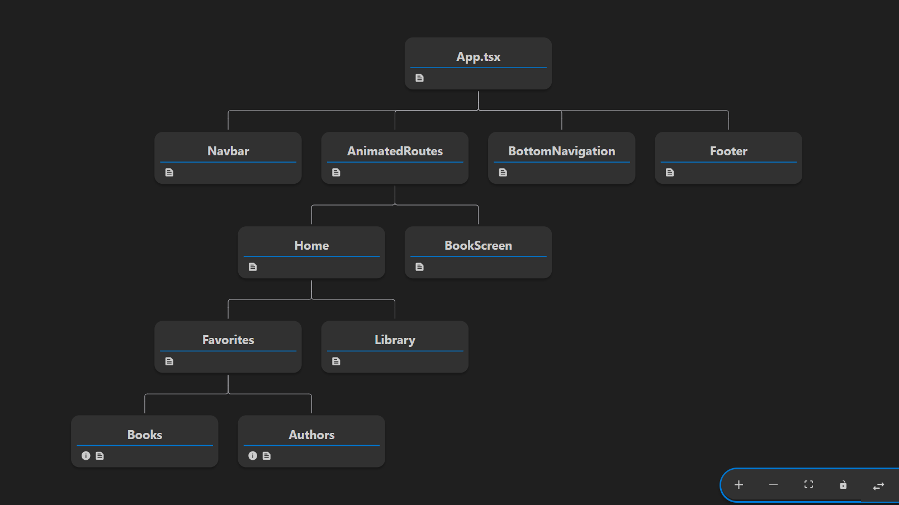

# Aplicação SSBOOK da Studio Sol

### Desenvolvi essa aplicação conforme indicado nos materiais utilizando as seguintes tecnologias, frameworks e bibliotecas:

- Typescript
- React Query
- Sass
- Framer Motion
- React router dom
- Interfaces

### As pastas foram organizadas da seguinte maneira:
| Caminho | Descrição |
| --- | --- |
| /components | Todos os componentes  |
| /interfaces | Interfaces utilizadas |
| /pages | Páginas da aplicação |
| /services | Chamadas à api |
| /styles | Estilização geral e específica dos componentes |
| /assets | Imagem da árvore de componentes |

### A seguir,  imagem referente à Árvore dos Componentes da minha aplicação, para tornar mais lúdico o compreendimento.

